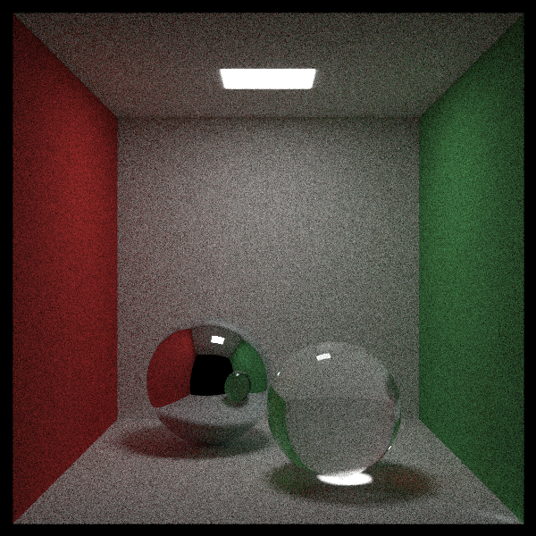
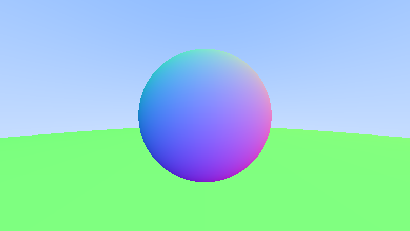
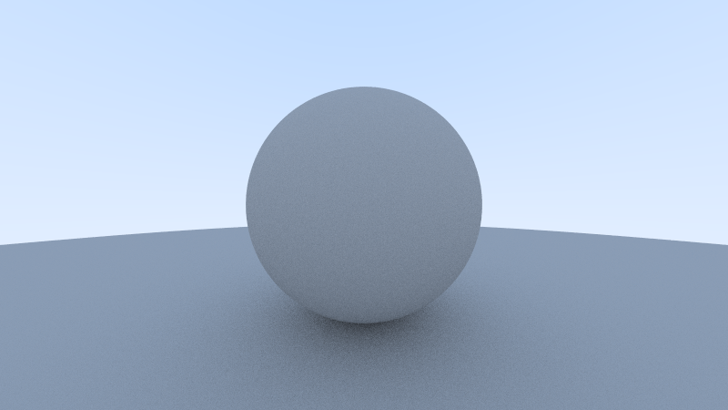
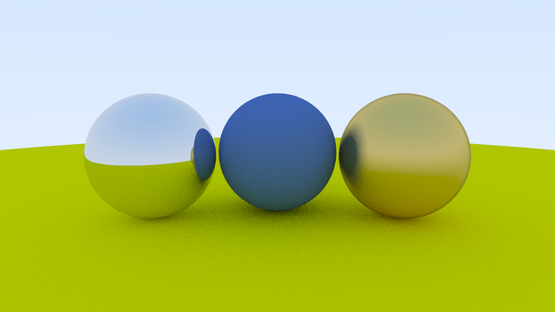
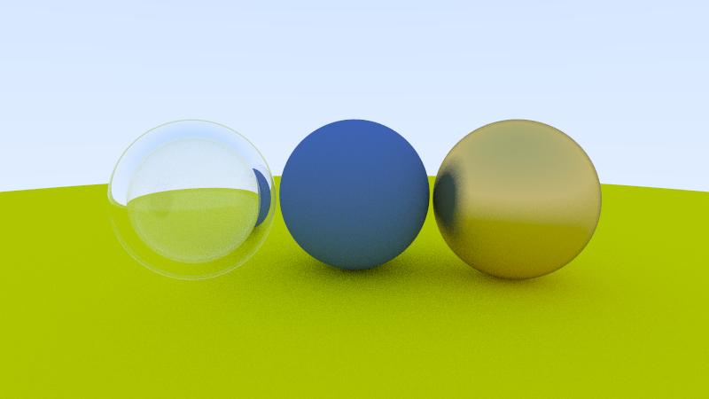
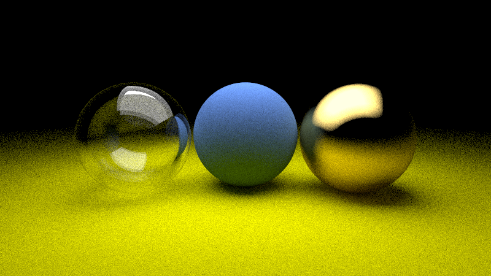
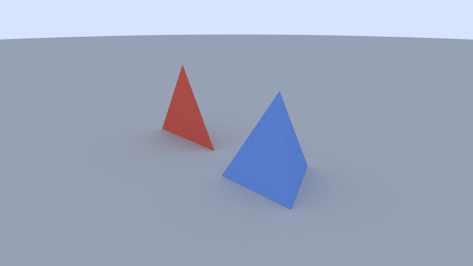
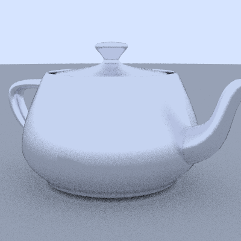
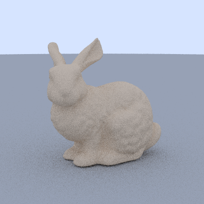

# Lumen

**A physically based path tracer written from scratch in modern C++.**

No game engine, no graphics API. Every pixel is computed by simulating how light bounces around a scene.



*Cornell box, 600x600, 500 samples per pixel. Note the red/green colour bleeding on the white surfaces and the caustic under the glass sphere.*

---

## Features

- **Monte Carlo path tracing** with recursive bounces and Russian-roulette-free depth limiting
- **Materials**
  - Lambertian (matte)
  - Metal with adjustable roughness (fuzz)
  - Dielectric (glass, water, diamond) with Snell's law, total internal reflection and Schlick's approximation
  - Emissive area lights
- **Geometry**
  - Spheres and quads (parallelograms)
  - Triangles with Möller-Trumbore intersection
  - Wavefront `.obj` mesh loading with scale, rotate and translate on load
  - Smooth shading from vertex normals, generated automatically for models that don't include them
- **Positionable camera** with configurable field of view, look-at and up vector
- **Antialiasing** via jittered supersampling
- **Gamma correction** and PNG output
- **Unit tests** with CTest

## Progress

Lumen is being built in public, one sprint at a time. Each render below was a milestone.

| | | |
|:---:|:---:|:---:|
|  |  |  |
| Camera and rays | Ray-sphere intersection | Diffuse bounces and gamma |
|  |  |  |
| Matte and metal | Glass with refraction | Area lights |
|  |  |  |
| Triangles | Utah teapot | Sir Hops-a-Lot (Stanford bunny) |

## Performance

| Scene | Resolution | Samples | Threads | Acceleration | Time |
|---|---|---|---|---|---|
| Cornell box | 600x600 | 500 | 1 | None | 135.4 s |
| Sir Hops-a-Lot, the Stanford bunny (69k tris) | 400x400 | 16 | 1 | None | 3702.9 s |

Without acceleration, every ray is tested against every triangle, so render time grows linearly with mesh size. Next up: BVH acceleration and multithreading. Before/after numbers will go here. Full results are in [docs/benchmarks.md](docs/benchmarks.md).

## Build and run

Requires CMake 3.20+ and a C++17 compiler (MSVC, GCC or Clang).

**Linux / macOS**
```bash
cmake -B build
cmake --build build
./build/lumen
```

**Windows (PowerShell)**
```powershell
cmake -B build
cmake --build build --config Release
.\build\Release\lumen.exe
```

The render is written to `output.png`. Run `lumen` from the repo root so it can find `assets/`. To change scenes, edit the scene picker in `main()` in `src/main.cpp`.

Run the tests with:
```bash
ctest --test-dir build -C Release
```

### Models

Mesh models are large, so they're not committed. Download them into `assets/models/`:

```bash
mkdir -p assets/models
curl -L -o assets/models/teapot.obj https://raw.githubusercontent.com/alecjacobson/common-3d-test-models/master/data/teapot.obj
curl -L -o assets/models/stanford-bunny.obj https://raw.githubusercontent.com/alecjacobson/common-3d-test-models/master/data/stanford-bunny.obj
curl -L -o assets/models/xyzrgb_dragon.obj https://raw.githubusercontent.com/alecjacobson/common-3d-test-models/master/data/xyzrgb_dragon.obj
```

On Windows PowerShell, use `curl.exe` instead of `curl`.

| File | Triangles | Use |
|---|---|---|
| `teapot.obj` | ~6.3k | Correctness check |
| `stanford-bunny.obj` | ~69k | Benchmark scene (Sir Hops-a-Lot) |
| `xyzrgb_dragon.obj` | ~250k | Stress test |

The full 870k-triangle Stanford dragon is available as PLY from the [Stanford 3D Scanning Repository](https://graphics.stanford.edu/data/3Dscanrep/).

## How it works

1. The **camera** fires rays through each pixel, many per pixel with random jitter (antialiasing).
2. Each ray is tested against every object to find the **closest hit**.
3. The hit surface's **material** decides what happens next: scatter randomly (matte), reflect (metal), refract or reflect (glass), or emit light (lights).
4. The ray **bounces** recursively, picking up colour from each surface, until it escapes the scene or hits the bounce limit.
5. All samples for a pixel are **averaged**, gamma corrected and written to PNG.

Because light paths are simulated physically, effects like soft shadows, colour bleeding and caustics appear naturally, without being programmed in.

Meshes are loaded as lists of triangles. Where a model has vertex normals, the normal at each hit point is blended from the triangle's three corners using barycentric coordinates. This makes a faceted mesh render as a smooth surface.

## Project structure

```
lumen/
├── include/lumen/   Headers: vec3, ray, camera, materials, shapes, obj loader
├── src/             Implementation and main
├── tests/           Unit tests
│   └── data/        Small .obj fixtures for the loader tests
├── external/        Third-party single-header libraries (stb_image_write, tinyobjloader)
├── assets/models/   Downloaded .obj models (not committed, see Models)
├── renders/         Milestone renders
└── docs/            Documentation and benchmarks
```

## Roadmap

- [x] **Sprint 1:** Foundations (vectors, rays, camera, spheres, PNG output)
- [x] **Sprint 2:** Materials and lighting (matte, metal, glass, area lights, Cornell box)
- [ ] **Sprint 3:** Performance
  - [x] Triangle primitive
  - [x] `.obj` mesh loading
  - [ ] BVH acceleration
  - [ ] Multithreading
  - [ ] Benchmarks
- [ ] **Sprint 4:** Polish (JSON scene files, CLI, live preview window, CI)

## References

- Peter Shirley, Trevor David Black, Steve Hollasch: [*Ray Tracing in One Weekend* series](https://raytracing.github.io/)
- Matt Pharr, Wenzel Jakob, Greg Humphreys: [*Physically Based Rendering*](https://pbr-book.org/)
- Tomas Möller, Ben Trumbore: [*Fast, Minimum Storage Ray/Triangle Intersection*](https://www.graphics.cornell.edu/pubs/1997/MT97.pdf) (1997)
- [The Cornell Box](https://www.graphics.cornell.edu/online/box/), Cornell University Program of Computer Graphics
- [The Stanford 3D Scanning Repository](https://graphics.stanford.edu/data/3Dscanrep/) (bunny, dragon)

## Third-party code

- [stb_image_write](https://github.com/nothings/stb) by Sean Barrett (public domain / MIT)
- [tinyobjloader](https://github.com/tinyobjloader/tinyobjloader) by Syoyo Fujita and contributors (MIT)